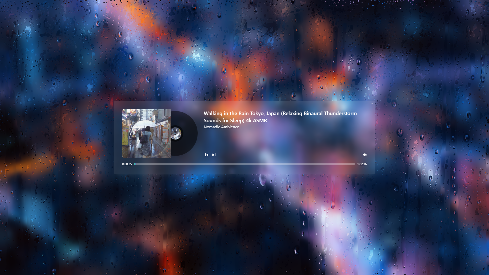

<p align="center">
  
   <br/>
  <a href="https://rainy.haku.dev" align="center">Rainy Day</a>
<p align="center">A cloudy day, turn on my Lo-fi playlist, a cup of hot coffee. Now I just need some rain.</p>
</p>

---

> This project was previously written in [React](https://github.com/let-lc/rainy-day-react). That project was achived because I wanted to learn a bit about svelte, so this is my first svelte project, re-written of a previous project with extra functions.

# Screenshot



# Development

**Requirements**

- [Node.js](https://nodejs.org/en/) 12.22.0 or later is recommended.

**Install dependencies**

```shell
npm install
# or
yarn install
```

**Start development server**

```shell
npm run dev
# or
yarn dev
```

Open [http://localhost:3000/](http://localhost:3000/) to view the project.
